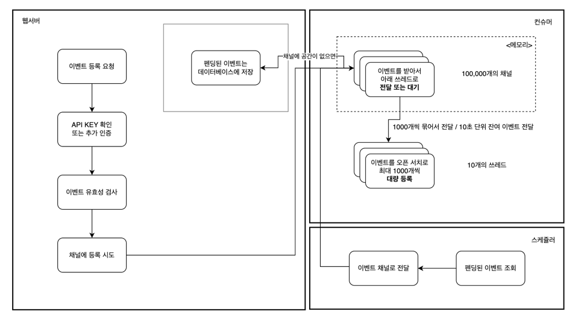

# Custom Event Collector

[한국어](README.ko.md) | [English](README.md)

## Project Overview

This is an event collection project designed to quickly and accurately collect events transmitted from applications.

Events are efficiently managed using channels, multiple parallel threads, and schedulers simultaneously.

Additionally, functionality has been implemented to temporarily store data in consideration of errors or memory
limitations.

### Key Features

- **Event Collection**: Collect event data via HTTP POST requests
- **OpenSearch Integration**: Bulk register event data to OpenSearch in real-time
- **Database Backup**: Pending data to database when channels are accumulated with too much data or OpenSearch storage
  fails
- **Authentication Middleware**: Maintain API security using Bearer tokens
- **Runtime Status Monitoring**: Check server status via `/ping` endpoint
- **Asynchronous Task Processing**: Asynchronous communication with OpenSearch and pending database
- **Appropriate Resource Configuration**: Channels are set to 100,000 as memory storage area, and OpenSearch bulk
  registration threads are set to 10

## Installation and Execution

### 1. Install Rust

This project was developed using Rust. Rust and Cargo must be installed on your system.

### 2. Clone Project

```bash
git clone https://github.com/lee-lou2/rust-events
cd https://github.com/lee-lou2/rust-events
```

### 3. Environment Variable Setup

Before running the project, add the following variables to the `.env` file:

```dotenv
OPEN_SEARCH_DNS=http://localhost:9200
SERVER_HOST=0.0.0.0
SERVER_PORT=3000
JWT_SECRET=
SERVER_ENVIRONMENT=local
DATABASE_URL=sqlite://sqlite3.db
```

### 4. Run Server

#### Run using cargo

```bash
cargo run
```

#### Run using docker

```bash
sh deploy.sh
```

Server will run at: `http://0.0.0.0:3000` (may vary depending on port set in environment variables)

## System Architecture

1. **Core Components**:
    - **Axum**: HTTP server framework
    - **OpenSearch**: Data storage
    - **SQLite**: Temporary storage for failed event data
    - **Tokio**: Asynchronous task executor

2. **Workflow**:
    - Client calls `/events` API and sends event data.
    - **Success**:
        - Attempts to deliver events to channels.
            - By default, 1000 channels are prepared.
            - If all channels are full, pending data is stored in the database.
            - If not full, data is delivered to the channel.
        - Data delivered to channels is bulk registered to OpenSearch in groups of 1000.
            - Even if not grouped up to 1000, bulk registers events in channels to OpenSearch every 10 seconds.
    - **Failure**:
        - If channels are full or errors occur during OpenSearch registration, pending data is stored in the database.
            - Such stored data is queried at 1-minute intervals and attempts to be re-delivered to channels.

    - Scheduler periodically attempts to send pending data to channels.

## Flowchart

Refer to the image below for system operation flow



## API Documentation

### **Authentication**

All endpoints except `/ping` require a Bearer token in the header.

If an invalid token is included or missing, an HTTP 401 response is returned.

### **POST /events**

- **Description**: Quickly and securely stores events.
- **HTTP Method**: POST
- **Headers**:
    - `Authorization: Bearer <API_KEY>` (required): Authentication token for API access
    - `device-uuid` (optional): Unique identifier of the device where the event occurred
    - `app-version` (optional): App version information
    - `os-version` (optional): Operating system version information
- **Request Body**: JSON
    - Fields:
        - `log_id` (required): Unique log identifier
        - `page` (required): Page where the event occurred
        - `event` (required): Event name
        - `label` (optional): Event label
        - `target` (optional): Event target
        - `section` (optional): Section where the event occurred
        - `param` (optional): Additional parameters(JSON)
- **Request Example**:

```bash
curl -X POST http://0.0.0.0:3000/events \
-H "Authorization: Bearer <API_KEY>" \
-H "Content-Type: application/json" \
-H "device-uuid: <DEVICE_UUID>" \
-H "app-version: <APP_VERSION>" \
-H "os-version: <OS_VERSION>" \
-d '{
  "page": "/home",
  "event": "click",
  "label": "button_click",
  "target": "#button_id",
  "section": "header",
  "param": {
    "key1": "value1"
  }
}'
```

- **Response**:
    - HTTP 200: Event registration request successful

### **GET /ping**

- **Description**: Check system status.
- **Response**:
    - HTTP 200: Returns "pong" string

## Project Roadmap

- [ ] Optimize event data latency
- [ ] Detailed handling of OpenSearch and database connection errors
- [ ] Add periodic cleanup functionality for event backup data
